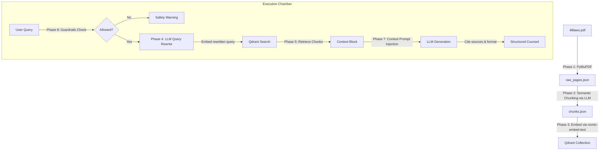

# Strategos AI — The 48 Laws of Power RAG Oracle

Strategos AI is a high-performance, retrieval-augmented generation (RAG) system built to provide wise, contextual, and practical strategic counsel. The project indexes and retrieves knowledge from Robert Greene's *The 48 Laws of Power*.

The repository contains two user interface options:
1. **Option A (Futuristic Next.js Chamber):** A custom, glassmorphic, luxury dark-themed Next.js console with step-by-step pipeline animations and structured card outputs.
2. **Option B (Streamlit Interface):** A standard Python web wrapper to run fast local queries.

---

## 🏛️ Project Architecture

Strategos AI operates in a 4-tiered RAG pipeline:



### 1. Data Ingestion Pipeline (`/ingestion`)
* **Phase 1: PDF Extraction (`extract.py`):** Uses PyMuPDF to extract text from every page of the PDF into [raw_pages.json](file:///c:/Work_files/Projects/strategos-ai/data/raw_pages.json).
* **Phase 2: Semantic Chunking (`semantic_chunk.py`):** Calls local LLMs (e.g. Gemma3/DeepSeek via Ollama) to identify natural conceptual boundaries rather than arbitrary line/word counts, outputting [chunks.json](file:///c:/Work_files/Projects/strategos-ai/data/chunks.json).
* **Phase 3: Embedding & Vector Storage (`embed.py`):** Generates 768-dimensional dense vectors using Ollama's `nomic-embed-text` and upserts them into a local Qdrant collection named `strategos_laws` with metadata payloads.

### 2. Retrieval & Generation Pipeline (`/rag` & `/landing/src/app/api`)
* **Phase 4: Query Rewriting (`rewrite.py`):** Translates colloquial user inputs into formal, concept-rich queries matching the historical structure of the book.
* **Phase 5: Retrieval (`retrieve.py`):** Performs cosine similarity search in Qdrant against the query's vector embedding.
* **Phase 7: Generation (`generate.py`):** Injects the retrieved chunks, page numbers, and law tags into the system instructions, instructing the model to output a structured layout (Laws, Interpretation, Action steps, Sources, and Confidence) citing only the provided context.
* **Phase 8: Safety Guardrails (`guardrails.py`):** Prevents malicious or violent application recommendations.

---

## 🏁 Execution Guide

### 📋 1. Start Prerequisites
You must start the vector database and local embedding service.

#### Run Qdrant (Vector Database)
```bash
docker run -p 6333:6333 qdrant/qdrant
```

#### Run Ollama (Embedding & Local LLM Service)
1. Start the **Ollama Desktop Application** or service daemon.
2. Download the required embedding model:
   ```bash
   ollama pull nomic-embed-text
   ```

---

### 🔢 2. Ingestion Setup
Since the pre-computed raw pages and chunks are already cached in your `data/` directory, ingestion only takes a minute:

1. Activate the Python virtual environment:
   ```powershell
   .\.venv\Scripts\activate
   ```
2. Install Python dependencies:
   ```bash
   pip install -r requirements.txt
   ```
3. Execute ingestion:
   ```bash
   python run_ingestion.py
   ```

---

## 🖥️ 3. Start Interfaces

Choose between running the original Streamlit wrapper or the futuristic Next.js application.

### Option A: Next.js Chamber (Next.js 16 + App Router)
1. Open a terminal in the `/landing` folder:
   ```bash
   cd landing
   ```
2. Start the dev server:
   ```bash
   npm run dev
   ```
3. Access the web interface at [http://localhost:3000](http://localhost:3000).

---

### Option B: Streamlit Python Application
1. In the project root directory, run:
   ```bash
   streamlit run streamlit_app.py
   ```
2. Access the interface at [http://localhost:8501](http://localhost:8501).
