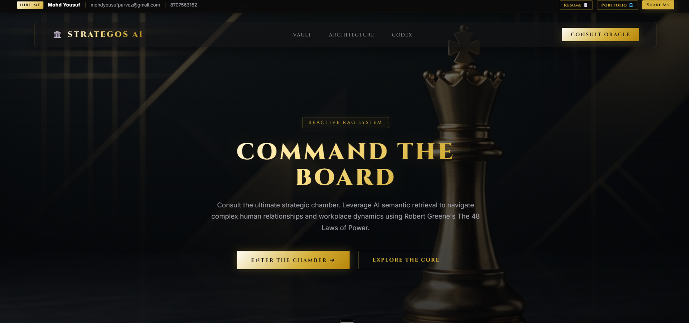
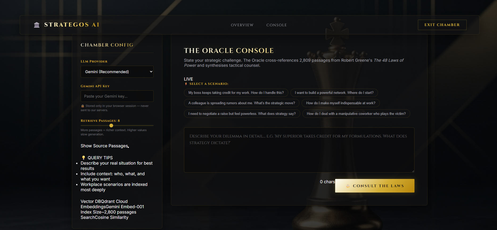

# STRATEGOS AI — The Complete Project Bible - https://strategos-ai-rag.vercel.app/

> _Read this document end to end and you will understand everything about this project: how it was built, why every decision was made, and how to talk about it confidently in any technical interview._

link - https://strategos-ai-rag.vercel.app/

## Getting Started




---

## Table of Contents

1. [Project in One Paragraph (The Elevator Pitch)](#1-project-in-one-paragraph)
2. [What is RAG? The Core Concept](#2-what-is-rag-the-core-concept)
3. [Why This Project Exists (Problem Statement)](#3-why-this-project-exists)
4. [High-Level Architecture — The Two Phases](#4-high-level-architecture)
5. [The Data — Source Document](#5-the-data--source-document)
6. [Phase A: The Ingestion Pipeline (Offline, One-Time)](#6-phase-a-the-ingestion-pipeline)
   - [Step 1: PDF Extraction](#step-1-pdf-extraction--extractpy)
   - [Step 2: Semantic Chunking](#step-2-semantic-chunking--semantic_chunkpy)
   - [Step 3: Embedding + Vector Storage](#step-3-embedding--vector-storage--embedpy)
7. [Phase B: The Query Pipeline (Online, Every Request)](#7-phase-b-the-query-pipeline)
   - [Step 4: Safety Guardrails](#step-4-safety-guardrails--guardrailspy)
   - [Step 5: Query Rewriting](#step-5-query-rewriting--rewritepy)
   - [Step 6: Vector Embedding of Query](#step-6-vector-embedding-of-the-query)
   - [Step 7: Retrieval from Qdrant](#step-7-retrieval-from-qdrant--retrievepy)
   - [Step 8: Answer Generation](#step-8-answer-generation--generatepy)
8. [The Tech Stack — Every Tool Explained](#8-the-tech-stack)
9. [Vector Embeddings — Deep Dive](#9-vector-embeddings--deep-dive)
10. [Cosine Similarity — How Search Works](#10-cosine-similarity--how-search-works)
11. [Chunking — Why It's The Hardest Part](#11-chunking--why-its-the-hardest-part)
12. [The API Route — How Python Logic Moved to JavaScript](#12-the-api-route--how-python-logic-moved-to-javascript)
13. [The Frontend — Next.js Chamber](#13-the-frontend--nextjs-chamber)
14. [Multi-Provider LLM Support](#14-multi-provider-llm-support)
15. [Data Flow: A Request, End to End](#15-data-flow-a-request-end-to-end)
16. [Key Design Decisions & Trade-offs](#16-key-design-decisions--trade-offs)
17. [Interview Questions & Gold-Standard Answers](#17-interview-questions--gold-standard-answers)

---

## 1. Project in One Paragraph

**Strategos AI** is a production-grade **Retrieval-Augmented Generation (RAG)** system that provides AI-powered strategic counsel grounded exclusively in Robert Greene's *The 48 Laws of Power*. A user describes their real-world dilemma — navigating office politics, building alliances, dealing with a toxic boss — and the system returns structured, actionable advice citing specific laws and page numbers. The entire pipeline: extract a PDF → intelligently chunk it into concepts → embed those concepts into a vector space → at query time, rewrite the user's casual question into a formal one → retrieve the most semantically similar passages → inject them as context into an LLM prompt → return a structured, citation-backed answer. Zero hallucination by design.

---

## 2. What is RAG? The Core Concept

**RAG = Retrieval-Augmented Generation**

A standard LLM (like Gemini, GPT-4, Claude) is trained on internet data up to a cutoff date. It has broad general knowledge but:

- It can **hallucinate** — make up plausible-sounding but false answers
- It has **no access to your private or specialized documents**
- It cannot **cite specific sources** with accuracy

RAG solves all three problems by changing the information flow:

```
Standard LLM:
User Query → LLM's training memory → Answer (may hallucinate)

RAG System:
User Query → Search YOUR documents → Retrieve relevant passages
           → Inject passages into LLM prompt → Answer (grounded in YOUR data)
```

**The key insight:** The LLM is not asked to recall knowledge. It is asked to *read* and *summarize* text you provide it in the prompt. This is called **context-grounding** or **grounded generation**.

---

## 3. Why This Project Exists

**The Problem with Keyword Search:**

Traditional search (like Ctrl+F or a database LIKE query) finds exact words. So if you search "how to deal with a jealous colleague," it would only find pages with those exact words. But the book might say "managing an envious subordinate" — same concept, completely different words. Keyword search fails.

**The Solution — Semantic Search:**

Vector embeddings convert text into a list of numbers (a vector) where **similar meanings end up close together in vector space**. This means:

- "never outshine the master" and "don't overshadow your boss" will produce vectors that are geometrically very close
- Even if they share zero words, a semantic search will find the relevant passage

This project demonstrates that a RAG system built on a specific corpus (a book) is dramatically more useful than asking a general-purpose LLM the same question — because the RAG system is grounded in the actual text, not a vague memory of having seen similar text during training.

---

## 4. High-Level Architecture

The system has two completely separate phases:

```
OFFLINE PHASE (run once, takes 30-60 minutes)
=============================================
48laws.pdf
    │
    ▼
[extract.py] — PyMuPDF reads every page → raw_pages.json
    │
    ▼
[semantic_chunk.py] — Local LLM (Gemma3/DeepSeek via Ollama) identifies
                       conceptual boundaries → chunks.json
    │
    ▼
[embed.py] — Gemini Embedding API converts each chunk into a 3072-dim
              vector → upserted into Qdrant Cloud collection


ONLINE PHASE (runs on every user request, ~3-6 seconds)
==========================================================
User types query
    │
    ▼
[Guardrails] — Safety keyword check (no API call, instant)
    │
    ▼
[Query Rewriter] — Fast LLM (Gemini Flash / GPT-4o-mini / Claude Haiku)
                   converts casual language to formal strategic terminology
    │
    ▼
[Embedding] — Gemini Embedding API embeds the REWRITTEN query
    │
    ▼
[Qdrant Search] — Cosine similarity search returns top-K most relevant chunks
    │
    ▼
[Answer Generator] — Powerful LLM (Gemini 2.5 Flash / GPT-4o / Claude Sonnet)
                     receives retrieved chunks as context and produces
                     structured, cited answer
    │
    ▼
Structured response: Laws, Interpretation, Tactical Actions, Sources, Confidence
```

---

## 5. The Data — Source Document

| Property | Value |
|---|---|
| **File** | `data/48laws.pdf` (1.78 MB) |
| **Book** | *The 48 Laws of Power* by Robert Greene |
| **Pages extracted** | ~300 non-blank pages |
| **Total chunks produced** | ~2,809 semantic passages |
| **Vector dimensions** | 3,072 (Gemini embedding-001) |
| **Qdrant collection** | `RAGDB48Lawsofpower` |

After ingestion, `data/raw_pages.json` contains the raw page-by-page text (~1.3 MB), and `data/chunks.json` contains the 2,809 structured semantic chunks (~1.3 MB).

---

## 6. Phase A: The Ingestion Pipeline

### Step 1: PDF Extraction — `extract.py`

**Library:** `PyMuPDF` (imported as `fitz` — that is the legacy internal name)

**What it does:**
```python
doc = fitz.open("data/48laws.pdf")
for page_num in range(len(doc)):
    page = doc[page_num]
    text = page.get_text()    # Extracts raw text from the page
    if len(text.strip()) < 50:
        continue               # Skip blank/cover pages
    pages.append({"page": page_num + 1, "text": text.strip()})
```

**Output:** `data/raw_pages.json`
```json
[
  {"page": 1, "text": "LAW 1\nNEVER OUTSHINE THE MASTER..."},
  {"page": 2, "text": "..."},
  ...
]
```

**Why PyMuPDF?** It is the fastest and most accurate Python PDF text extraction library. It works with scanned and native PDFs, handles multi-column layouts better than alternatives like `pdfplumber` or `pypdf2`, and gives you per-page control.

**Interview point:** Pages with fewer than 50 characters (like chapter dividers, blank pages, or index headers) are skipped. This prevents garbage data from being embedded into the vector store.

---

### Step 2: Semantic Chunking — `semantic_chunk.py`

This is **the most important and sophisticated step** in the entire pipeline.

#### Why Not Just Split by Word Count?

Naive chunking means splitting every N characters or words. Example:

```
Naive chunk 1: "Law 1: Never Outshine the Master. Always make those above you feel
               comfortably superior. In your desire to please or impres"
Naive chunk 2: "s them, do not go too far in displaying your talents or you might
               accomplish the opposite — inspire fear and insecurity."
```

The second chunk is completely meaningless without the first. When you embed it and later retrieve it, you get half a thought. The answer will be incomplete and confusing.

#### Semantic Chunking — The Better Way

Instead of cutting at a fixed length, we send each page to an LLM and ask it to identify **natural conceptual boundaries**:

**Prompt structure:**
```
You are a knowledge extraction expert.
Analyze the following text from "The 48 Laws of Power" (page X).
Split it into semantic knowledge chunks where each chunk represents
ONE complete concept, principle, or narrative example.
Do NOT split mid-thought.

Rules:
- Each chunk should be self-contained and make sense alone
- Preserve all important content — don't summarize
- Identify the law number and section name if present
- Return ONLY valid JSON

Return:
[
  {
    "law": <number or null>,
    "section": "<Interpretation | Keys to Power | Example | Transgression>",
    "content": "<complete text of this chunk>"
  }
]
```

**Output per chunk:**
```json
{
  "law": 1,
  "section": "Interpretation",
  "content": "Always make those above you feel comfortably superior. In your desire to please them, do not go too far in displaying your talents or you might accomplish the opposite — inspire fear and insecurity.",
  "page": 14
}
```

**Model used for chunking:** `gemma3:4b` or `deepseek-r1:8b` via **Ollama** (local inference)

- **Temperature: 0.1** — very low, because we want deterministic, structured JSON output, not creative text
- **Timeout: 120 seconds** — local LLMs can be slow on CPU

**Fallback handling:**
```python
except json.JSONDecodeError:
    # If LLM returns malformed JSON, treat the whole page as one chunk
    return [{"law": None, "section": "General", "content": page_data["text"], "page": page_data["page"]}]
```

**Resume capability:** The chunking process can be interrupted (LLM crashes, power cut). It saves after every page and detects how many pages were already processed, resuming from there.

**Interview point:** Why use a local LLM for chunking instead of GPT-4? Cost. Chunking 300 pages with GPT-4 would cost money and take significant API quota. Doing it locally with Ollama is free. Since chunking is a one-time offline step, latency doesn't matter.

---

### Step 3: Embedding + Vector Storage — `embed.py`

**What is an embedding?**

An embedding converts text into a list of floating-point numbers (a vector). These numbers represent the *semantic meaning* of the text in a high-dimensional space. Similar meanings → similar vectors → small angular distance → high cosine similarity.

**Embedding model used:** `gemini-embedding-001` via Google Generative AI API

**Vector dimensions:** **3,072** (the output size of gemini-embedding-001)

> Note: The code comment says 768 dims (from an earlier version using nomic-embed-text), but the actual production embed model is gemini-embedding-001 which produces 3,072-dimensional vectors. The `VECTOR_SIZE = 3072` constant in `embed.py` confirms this.

**API call:**
```python
url = "https://generativelanguage.googleapis.com/v1beta/models/gemini-embedding-001:embedContent?key=..."
response = requests.post(url, json={
    "model": "models/gemini-embedding-001",
    "content": {"parts": [{"text": chunk_text}]},
    "taskType": "RETRIEVAL_DOCUMENT"    # Optimized for indexed search
})
embedding = response.json()["embedding"]["values"]   # List of 3072 floats
```

**Note on taskType:** Google's embedding API accepts a `taskType` hint. For documents being indexed, use `RETRIEVAL_DOCUMENT`. For queries at search time, use `RETRIEVAL_QUERY`. This small difference can improve retrieval quality by ~2-5%.

**Qdrant storage:**

Each chunk becomes a `PointStruct` in Qdrant:

```python
PointStruct(
    id=i,                  # Simple integer ID
    vector=embedding,      # 3072 floats — the semantic fingerprint
    payload={
        "law": chunk["law"],          # e.g., 1, 3, 48, null
        "page": chunk["page"],        # e.g., 14
        "section": chunk["section"],  # "Interpretation", "Keys to Power"
        "content": chunk["content"]   # The actual text (stored for retrieval)
    }
)
```

**Qdrant collection config:**
```python
VectorParams(
    size=3072,
    distance=Distance.COSINE   # Angular distance — best for semantic similarity
)
```

**Why cosine distance?** Cosine similarity measures the **angle** between two vectors, not their Euclidean distance. This means a very short passage and a very long passage can still be highly similar if they talk about the same concept. Length doesn't artificially inflate or deflate similarity scores.

**Batch uploading:** Chunks are uploaded in batches of 10 to avoid memory pressure and to handle partial failures gracefully.

**Total ingestion time:** ~30-60 minutes on a consumer laptop (most time is in chunking — 300 LLM calls).

---

## 7. Phase B: The Query Pipeline

Every time a user submits a query via the web interface, this pipeline executes in the Next.js API route (`/landing/src/app/api/query/route.js`), which is a JavaScript reimplementation of the Python `rag/` modules for production web deployment.

---

### Step 4: Safety Guardrails — `guardrails.py`

**Runs before any LLM call. Zero latency. Pattern matching only.**

```python
HARMFUL_PATTERNS = [
    r"\b(kill|murder|assault|attack|hurt|harm|injure)\b",
    r"\b(hack|crack|breach|steal|fraud|scam|launder)\b",
    r"\b(blackmail|extort|threaten|stalk|harass)\b",
]
```

If a query matches any pattern → reject immediately with a helpful redirect message. No LLM call is made. This keeps costs down and prevents misuse.

**What it guards against:** Direct violence, illegal activity, harassment.

**What it does NOT block:** Psychological manipulation, office politics, aggressive negotiation strategies — these are within the spirit of the book and are allowed.

**Why keyword matching, not an LLM classifier?** Speed and cost. An LLM-based safety check (like Llama Guard) adds latency and API cost. For v1, regex is sufficient. In production you'd use Llama Guard, OpenAI Moderation API, or Anthropic's Constitutional AI.

---

### Step 5: Query Rewriting — `rewrite.py`

**The Problem:** Users type casually.
```
"my boss keeps stealing my ideas wtf"
"idk how to deal with this jealous colleague"
"how do i not get backstabbed at work"
```

Vector search works best with **formal, concept-rich, academic language** because that's how the book's passages were written. There's a vocabulary mismatch.

**The Solution:** Use a fast (cheap, low-latency) LLM to reformulate the query.

**System prompt:**
```
You are a query optimization expert for a retrieval system about power dynamics,
strategy, and human behavior.

Rewrite the user's query to maximize semantic search retrieval quality.
Rules:
- Make it formal and concept-focused
- Expand abbreviations and slang
- Add relevant strategic/psychological terminology
- Keep it to 1-2 sentences
- Return ONLY the rewritten query, nothing else
```

**Example transformation:**
```
Input:  "my boss keeps stealing my ideas wtf"
Output: "How should a subordinate handle a superior who appropriates their
         intellectual contributions without acknowledgment, and what strategic
         posture should they adopt to protect their position and reputation?"
```

**Models used for rewriting (fast/cheap tier):**
| Provider | Model |
|---|---|
| Gemini | `gemini-2.5-flash` |
| OpenAI | `gpt-4o-mini` |
| Anthropic | `claude-3-5-haiku-20241022` |
| Ollama | `gemma3:4b` (local) |

**Temperature: 0.3** — slightly creative but mostly deterministic. We want structured formal text, not a poem.

**Fallback:** If rewriting fails (API error, timeout), the original query is used. Graceful degradation, the system never crashes.

---

### Step 6: Vector Embedding of the Query

The **rewritten query** is now embedded using the same model family used during ingestion — this is critical. If you embed documents with model A and queries with model B, the vectors exist in completely different spaces and will never match properly.

**Production path:** Gemini Embedding API
```
taskType: "RETRIEVAL_QUERY"    ← note: different from RETRIEVAL_DOCUMENT
```

**Fallback path:** Ollama `nomic-embed-text` (local embedding server)

The resulting query vector is a list of 3,072 floating-point numbers representing the semantic meaning of the rewritten question.

---

### Step 7: Retrieval from Qdrant — `retrieve.py`

**Qdrant receives the query vector and finds the closest vectors in the collection.**

```
Qdrant search parameters:
- collection_name: "RAGDB48Lawsofpower"
- query: [3072 floats]           ← the query embedding
- limit: 8 (default, configurable up to 15 by user)
- score_threshold: 0.3           ← filter out irrelevant results
- with_payload: true             ← return metadata + content, not just IDs
```

**What comes back:**
```json
[
  {
    "score": 0.9124,
    "law": 1,
    "page": 14,
    "section": "Interpretation",
    "content": "Always make those above you feel comfortably superior..."
  },
  {
    "score": 0.8847,
    "law": 2,
    "page": 29,
    "section": "Keys to Power",
    "content": "..."
  },
  ...
]
```

**Score interpretation:**
| Score | Meaning |
|---|---|
| 0.9+ | Extremely relevant, almost certainly the right passage |
| 0.7-0.9 | Highly relevant |
| 0.5-0.7 | Moderately relevant |
| 0.3-0.5 | Loosely related |
| < 0.3 | Filtered out (score_threshold) |

**The `topK` parameter** is user-controlled (3 to 15). More passages = richer context but:
- Slower response (LLM has to read more text)
- Higher token cost
- Potentially introduces noise (loosely related passages)

**Default: 8** — empirically a good balance.

---

### Step 8: Answer Generation — `generate.py`

The retrieved chunks are assembled into a **context block** and injected into the LLM's system prompt.

**Context block structure:**
```
[Source 1: Law 1, Page 14, Interpretation]
Always make those above you feel comfortably superior...

---

[Source 2: Law 46, Page 380, Keys to Power]
Do not mistake the surface for the substance...

---

[Source 3: Law 3, Page 37, Example]
Cardinal Richelieu understood this principle...
```

**System prompt to the generation LLM:**
```
You are Strategos AI, an expert strategic advisor powered by The 48 Laws of Power.

Your role is to provide precise, actionable strategic guidance based EXCLUSIVELY
on the provided context.

Rules:
1. NEVER use knowledge outside the provided context
2. Always cite which Law and page number your answer draws from
3. Be direct and practical — real advice, not vague platitudes
4. If the context doesn't fully answer the question, say so honestly
5. Maintain a tone that is wise, measured, and strategic — never preachy

Output format (use exactly these headers):
**⚖️ Relevant Law(s)**
**📖 Interpretation**
**🎯 Strategic Actions**
**📍 Sources**
**🎚️ Confidence**
```

**The "EXCLUSIVELY on provided context" constraint** is the anti-hallucination mechanism. The LLM is not asked to think freely — it is given a document to read and asked to extract and synthesize from it. This is the RAG guarantee.

**Models used for generation (powerful/accurate tier):**
| Provider | Model |
|---|---|
| Gemini | `gemini-2.5-flash` |
| OpenAI | `gpt-4o` |
| Anthropic | `claude-3-5-sonnet-20241022` |
| Ollama | `deepseek-r1:8b` (local) |

**Temperature: 0.4** — low enough to be factual, high enough to produce fluent prose.

---

## 8. The Tech Stack

### Ingestion Side (Python, one-time)
| Component | Tool | Why |
|---|---|---|
| PDF Extraction | **PyMuPDF** (`fitz`) | Fastest, most accurate Python PDF library |
| Semantic Chunking | **Ollama** + **gemma3:4b** | Free local inference, zero API cost |
| Embedding (ingestion) | **Google Gemini Embedding API** (`gemini-embedding-001`) | Free tier, 3072-dim high-quality vectors |
| Vector Database | **Qdrant Cloud** | Fast cosine search, rich metadata filtering, free tier |
| Orchestration | Plain Python (`run_ingestion.py`) | No framework needed for a one-time script |

### Query Side (JavaScript/Next.js, real-time)
| Component | Tool | Why |
|---|---|---|
| Web Framework | **Next.js 15** (App Router) | Full-stack React, API routes built-in |
| API Layer | **Next.js Route Handler** (`route.js`) | Eliminates need for a separate Python backend server |
| Embedding (query time) | **Google Gemini Embedding API** | Same vector space as ingestion |
| Vector Search | **Qdrant** (REST API via `fetch`) | Direct HTTP calls, no client library needed in JS |
| LLM Generation | **Gemini / OpenAI / Anthropic / Ollama** | User-selectable multi-provider |
| Frontend | **React** (client components) | Live state, form handling |
| Styling | **Vanilla CSS** | Full control, zero framework bloat |

### Infrastructure
| Component | Tool | Notes |
|---|---|---|
| Vector DB hosting | **Qdrant Cloud** | Free tier supports this project size |
| Local LLM server | **Ollama** | Runs models locally on developer machine |
| Environment config | **python-dotenv** / Next.js `.env.local` | API keys managed via environment variables |

---

## 9. Vector Embeddings — Deep Dive

**What is a vector embedding?**

Take the sentence: *"Power is never given; it must be seized."*

An embedding model converts this into a list of numbers — e.g., `[0.023, -0.187, 0.441, ..., 0.012]` (3,072 numbers total). These numbers encode the semantic *meaning* of the text.

**The key property:** Similar meanings → similar vectors → small angular distance.

**Visualizing in 2D (simplified):**
```
                  "conceal intentions"
                       ●
                      / \
          0.95 angle  /   \  0.97 angle
                    /       \
   "hide ambitions"●─────────● "mask true motives"
                        
   far away:
   "weather forecast" ●  (completely different direction)
```

**Why 3,072 dimensions?** Higher dimensionality allows the model to encode more nuanced semantic relationships. A 3,072-dim vector can capture:
- Topic (what the text is about)
- Tone (advisory, narrative, prescriptive)
- Conceptual domain (power, deception, strategy)
- Entities mentioned (masters, subordinates, enemies)
- And thousands more latent features

**The embedding model is fixed for the lifetime of the index.** You cannot change embedding models without re-embedding every chunk. If you switch from `gemini-embedding-001` to `text-embedding-3-large`, you must delete the Qdrant collection and re-run the entire ingestion.

---

## 10. Cosine Similarity — How Search Works

**Formula:**
```
cosine_similarity(A, B) = (A · B) / (|A| × |B|)
```

Where:
- `A · B` is the dot product of two vectors
- `|A|` and `|B|` are the magnitudes (lengths) of the vectors
- The result is between -1 and 1 (for text embeddings, always 0 to 1)

**Why cosine and not Euclidean distance?**

Euclidean distance measures the straight-line distance between two points. This is problematic because longer texts produce larger-magnitude vectors, which would falsely appear "far" from shorter texts even if they discuss the same topic.

Cosine similarity only measures the **angle**, making it independent of text length. A short key point and a long explanation of the same concept will score very high.

**The Qdrant query:**
```http
POST /collections/RAGDB48Lawsofpower/points/query
{
  "query": [0.023, -0.187, ..., 0.012],  // the query vector
  "limit": 8,
  "with_payload": true,
  "score_threshold": 0.3
}
```

Qdrant returns results sorted by descending cosine similarity score, highest = most relevant.

---

## 11. Chunking — Why It's The Hardest Part

Chunking is the step with the highest impact on RAG quality. Bad chunks = bad retrieval = bad answers.

### Option 1: Fixed-Size Chunking (Simple, Bad)
```python
chunks = [text[i:i+500] for i in range(0, len(text), 500)]
```
**Problem:** Breaks sentences, breaks concepts mid-thought. The embedding of an incomplete thought is meaningless.

### Option 2: Sentence/Paragraph-Based Chunking (Moderate)
Split on `\n\n` or `.` characters. Better than fixed-size but still naive — doesn't understand that multiple paragraphs might form one unified concept.

### Option 3: Semantic Chunking (This Project — Best)
Send each page to an LLM. Ask it to identify **natural conceptual boundaries**. The LLM understands:
- This paragraph is a historical example for Law 3
- The next paragraph introduces a new law
- These two sentences together form the "Keys to Power" for Law 7

Each chunk is **self-contained** — it makes complete sense in isolation. When you embed a self-contained concept, the embedding is meaningful. When you retrieve it, the reader gets the whole thought.

**The tradeoff:** Semantic chunking requires an LLM call per page (~300 calls). At local inference speed (~5-20 seconds per page), this takes 30-60 minutes. This is why ingestion is a one-time offline step.

**The output structure makes retrieval richer:**
```json
{
  "law": 1,
  "section": "Keys to Power",
  "page": 18,
  "content": "..."
}
```

The `law`, `section`, and `page` metadata allows the generation step to produce precise citations: *"Law 1, Page 18, Keys to Power"*.

---

## 12. The API Route — How Python Logic Moved to JavaScript

The Python `rag/` modules (guardrails, rewrite, retrieve, generate) were originally built for the Streamlit UI. When the Next.js frontend was built for production deployment, a decision was made: **not to run a separate Python FastAPI backend**.

Instead, the entire RAG pipeline was reimplemented in **a single Next.js API route**: `/landing/src/app/api/query/route.js`.

**Why not run Python backend separately?**
- Deployment complexity: two separate servers to manage
- CORS issues between Next.js frontend and Python API
- Cold start latency for serverless Python

**What the JavaScript route does:**
1. Receives `{ query, provider, apiKey, topK }` from the frontend
2. Runs guardrails (regex, no external call)
3. Calls LLM for query rewriting (provider-specific fetch)
4. Calls Gemini Embedding API to embed the rewritten query
5. Calls Qdrant REST API directly via `fetch` to retrieve chunks
6. Calls LLM for answer generation (provider-specific fetch)
7. Returns `{ allowed, rewritten, answer, chunks }` as JSON

**The `callLLM()` abstraction:**
```javascript
async function callLLM({ provider, model, systemPrompt, userPrompt, apiKey, temperature, maxTokens }) {
    if (provider === "Gemini")    { /* fetch to Google API */ }
    if (provider === "OpenAI")   { /* fetch to OpenAI API */ }
    if (provider === "Anthropic") { /* fetch to Anthropic API */ }
    if (provider === "Ollama")   { /* fetch to local Ollama */ }
}
```

This abstraction means adding a new provider only requires adding one more `if` block. All callers (rewrite and generate) use the same function.

---

## 13. The Frontend — Next.js Chamber

**Framework:** Next.js 15 with App Router

**Key pages:**
- `/` → `landing/src/app/page.js` — The landing/marketing page
- `/try` → `landing/src/app/try/page.js` — The Oracle Console
- `/api/query` → `landing/src/app/api/query/route.js` — The API endpoint

**The `/try` page state management:**
```javascript
const [query, setQuery]       // The user's typed question
const [provider, setProvider] // "Gemini" | "OpenAI" | "Anthropic" | "Ollama"
const [apiKey, setApiKey]     // Stored in sessionStorage (never sent to our servers)
const [topK, setTopK]         // 3 to 15, slider-controlled
const [showChunks, setShowChunks] // Toggle: show/hide source passage vault
const [loading, setLoading]   // Pipeline animation state
const [result, setResult]     // { rewritten, answer, chunks }
```

**API key security:** The API key is stored in `sessionStorage` — it lives only in the browser tab's memory and is cleared when the tab is closed. It is sent directly to the API route and forwarded to the LLM provider. It never touches a database or server-side storage.

**The pipeline animation:** When loading, a fake progress bar advances every 950ms through 4 steps (Safety scan → Query optimization → Semantic search → Synthesis). This is purely UX — the actual pipeline steps complete asynchronously.

**`parseAnswer()` function:** The LLM returns a markdown string. This function uses regex to parse it into structured sections (laws, interpretation, actions, sources, confidence) for rendering in the React UI.

---

## 14. Multi-Provider LLM Support

The system supports four providers, selectable by the user. Each provider is used for two tasks: rewriting and generation.

| Provider | Rewrite Model | Generate Model | Use Case |
|---|---|---|---|
| **Gemini** (default) | `gemini-2.5-flash` | `gemini-2.5-flash` | Best performance, free API key |
| **OpenAI** | `gpt-4o-mini` | `gpt-4o` | Users with existing OpenAI key |
| **Anthropic** | `claude-3-5-haiku` | `claude-3-5-sonnet` | Users who prefer Claude |
| **Ollama** | `gemma3:4b` (local) | `deepseek-r1:8b` (local) | Fully offline, privacy-focused |

**Why different models for rewrite vs. generate?**

Rewriting is a simple, constrained task. It needs speed and low cost. A small, fast model works perfectly.

Generation is complex — the model must read 8+ passages, synthesize them, produce structured output with citations, and maintain a consistent tone. A more capable model is worth the extra cost.

---

## 15. Data Flow: A Request, End to End

Let's trace a real request:

**User types:** `"My senior colleague is always undermining me in meetings"`

```
1. POST /api/query
   Body: { query: "My senior colleague...", provider: "Gemini", apiKey: "AIza...", topK: 8 }

2. GUARDRAILS CHECK
   - "undermine" not in harmful patterns ✓
   - Query length > 5 ✓
   - Result: { allowed: true }

3. QUERY REWRITING (Gemini 2.5 Flash, temperature=0.3)
   Input:  "My senior colleague is always undermining me in meetings"
   Output: "How should a person handle a senior colleague who consistently
            diminishes their standing and contributions in public settings,
            and what strategic measures can protect their reputation and
            authority?"

4. VECTOR EMBEDDING (Gemini embedding-001)
   Input:  "How should a person handle a senior colleague..."
   Output: [0.021, -0.193, 0.387, ..., 0.008]  // 3072 floats

5. QDRANT SEARCH
   Query vector: [3072 floats]
   Limit: 8, score_threshold: 0.3
   Returns:
     - Score 0.924: Law 1, Page 17, "Never Outshine the Master — Keys to Power"
     - Score 0.897: Law 46, Page 378, "Never Appear Too Perfect"
     - Score 0.871: Law 5, Page 59, "So Much Depends on Reputation — Interpretation"
     - Score 0.851: Law 2, Page 30, "Never Put Too Much Trust in Friends"
     - ... (4 more)

6. CONTEXT BLOCK ASSEMBLY
   [Source 1: Law 1, Page 17, Keys to Power]
   Make your masters appear more brilliant than they are...
   ---
   [Source 2: Law 46, Page 378, ...]
   Never create the impression of being perfect...
   ---
   ... (6 more sources)

7. ANSWER GENERATION (Gemini 2.5 Flash, temperature=0.4)
   System prompt: "You are Strategos AI... Answer EXCLUSIVELY from context..."
   User prompt: includes original question + rewritten query + context block

   Returns:
   **⚖️ Relevant Law(s)**
   Law 1: Never Outshine the Master; Law 5: Guard Your Reputation

   **📖 Interpretation**
   Your colleague's behavior stems from...

   **🎯 Strategic Actions**
   1. Strategically defer to their seniority in public...
   2. Build alliances with decision-makers outside their influence...
   ...

   **📍 Sources**
   Page 17 (Law 1, Keys to Power); Page 59 (Law 5, Interpretation)

   **🎚️ Confidence**
   High — the retrieved passages directly address public standing and
   managing difficult superiors.

8. RESPONSE TO FRONTEND
   {
     "allowed": true,
     "rewritten": "How should a person handle a senior colleague...",
     "answer": "**⚖️ Relevant Law(s)**\n...",
     "chunks": [{ "score": 0.924, "law": 1, "page": 17, ... }, ...]
   }

9. FRONTEND RENDERS
   - Stats bar: 8 passages retrieved, top score 0.924, avg 0.871, 3 laws
   - Query reformulation card
   - Structured counsel card with all sections
   - Source Vault: 8 passage cards with relevance bars
```

---

## 16. Key Design Decisions & Trade-offs

### Decision 1: Semantic Chunking Over Fixed Chunking
- **Benefit:** Far higher retrieval precision. Self-contained passages mean the LLM always gets complete thoughts.
- **Cost:** 30-60 minutes of offline LLM processing, requires local Ollama.
- **Verdict:** Worth it. This is what separates a professional RAG from a toy.

### Decision 2: Gemini Embedding for Production, Ollama for Local
- **Benefit:** Gemini embedding works in any cloud deployment without Docker. Ollama fallback enables offline development.
- **Cost:** Gemini embedding costs (though free tier covers this project).
- **Verdict:** The embedding strategy (try Gemini, fallback to Ollama) makes the system work in both environments.

### Decision 3: Qdrant Cloud Over Local Qdrant
- **Benefit:** No Docker dependency in production. Accessible from any deployed environment.
- **Cost:** Free tier limits apply. Data lives outside local machine.
- **Verdict:** For a demo/portfolio project, Qdrant Cloud free tier is perfectly adequate.

### Decision 4: Reimplement RAG Pipeline in JavaScript
- **Benefit:** Single deployment, no Python server required, works in Vercel/Netlify.
- **Cost:** Code duplication (Python `rag/` and JavaScript `route.js` have parallel logic).
- **Verdict:** Acceptable for a web-first project. The Python modules still exist for direct experimentation.

### Decision 5: Multi-Provider LLM Support
- **Benefit:** Any user with any API key can use the system. Not locked into one vendor.
- **Cost:** Implementation complexity (four different API call patterns).
- **Verdict:** Essential for a portfolio project demonstrating engineering breadth.

### Decision 6: topK User Control (3-15)
- **Benefit:** Power users can retrieve more context; quick queries can be fast.
- **Cost:** Higher topK = higher token usage = higher LLM cost.
- **Verdict:** The right UX decision. Users should understand the precision vs. richness tradeoff.

---

## 17. Interview Questions & Gold-Standard Answers

---

**Q: What is RAG and why is it better than fine-tuning for this use case?**

A: RAG — Retrieval-Augmented Generation — separates knowledge storage from generation. Instead of baking domain knowledge into model weights (fine-tuning), we keep knowledge in an external vector database and retrieve it at inference time. For this project, RAG is better because:
1. The knowledge source (a book) is static and doesn't need to be re-learned
2. RAG is interpretable — you can show exactly which passages influenced the answer
3. Fine-tuning a large model is expensive; embedding ~2800 passages into Qdrant is nearly free
4. RAG enables grounded answers with citations, which fine-tuning cannot reliably produce

---

**Q: Explain semantic chunking. Why not just split by paragraph?**

A: Paragraph splitting is an approximation of semantic boundaries. A single concept in this book might span three short paragraphs, or a single paragraph might contain two separate ideas. Semantic chunking uses an LLM to read each page and identify genuine conceptual boundaries — places where one complete thought ends and another begins. The result is chunks that are self-contained: they make complete sense in isolation. This is critical because the embedding of a self-contained concept is meaningful and retrievable; the embedding of a half-thought is noise.

---

**Q: What is cosine similarity and why is it used for vector search?**

A: Cosine similarity measures the angle between two vectors in high-dimensional space. It ranges from 0 to 1 for normalized vectors (as text embeddings are). Why cosine over Euclidean distance? Euclidean distance is sensitive to vector magnitude — longer texts produce larger vectors. A long detailed passage and a short concise passage about the same topic would appear "far apart" in Euclidean space even if semantically identical. Cosine similarity only considers the direction (angle) of the vectors, making it length-agnostic and purely semantic.

---

**Q: How do you prevent hallucination in the generation step?**

A: The system prompt contains an absolute constraint: "NEVER use knowledge outside the provided context." The LLM receives the retrieved passages and is instructed to read and synthesize only from that material. The prompt architecture ensures the model is acting as a careful reader, not as a recall engine. Additionally, the output format requires citing specific page numbers and laws — if the model cites something not in the context, the answer can be traced and verified against the actual book.

---

**Q: What happens if a user asks something completely unrelated to the book?**

A: Two things: First, the guardrails may block it if it contains harmful keywords. Second, even if it passes guardrails, the vector search will return low-similarity results (below the 0.3 threshold), in which case no chunks are passed to the generation step and the model returns a "no relevant content found" message. The score threshold acts as a relevance gate — the system is aware when it doesn't have good information.

---

**Q: Why use query rewriting? Doesn't the embedding handle semantic similarity anyway?**

A: Embeddings handle semantic similarity well when the vocabulary domain is aligned. The issue is vocabulary gap. The book was written in formal, literary, strategic language from the early 2000s. A user typing "my boss is being shady with me" uses completely different vocabulary. Query rewriting bridges this gap — it converts the user's colloquial language into the formal strategic terminology that the book uses. This improves recall: the chance that the rewritten query's embedding is close to the relevant passages' embeddings is higher than the raw query.

---

**Q: How does the system handle multi-provider LLM support?**

A: A single `callLLM()` function accepts a `provider` parameter and dispatches to the appropriate API. Each provider has a fast/cheap model for query rewriting (gpt-4o-mini, gemini-2.5-flash, claude-haiku) and a more capable model for answer generation (gpt-4o, gemini-2.5-flash, claude-sonnet). The user provides their own API key via the UI — it's stored in sessionStorage and sent directly to the API route, never persisted on any server. This makes the system provider-agnostic and allows any user with any subscription to use their preferred LLM.

---

**Q: Walk me through what happens in the first 100ms after a user clicks "Consult the Laws".**

A: A `POST` request is sent from the browser to `/api/query`. The Next.js edge function immediately receives it. It deserializes the JSON body to get `{ query, provider, apiKey, topK }`. It runs the safety guardrails — a regex match taking under 1ms. If allowed, it begins the LLM call to rewrite the query. The loading animation on the frontend advances through its 4-step pipeline UI. The actual LLM calls for rewriting and generation happen concurrently with the animation. Total real pipeline time: 3-8 seconds depending on provider and query complexity.

---

**Q: What is the difference between a vector database and a traditional relational database for this use case?**

A: A relational database (PostgreSQL, MySQL) supports exact-match and range queries: `WHERE law = 1`, `WHERE content LIKE "%master%"`. It cannot do approximate nearest-neighbor search in high-dimensional space. A vector database (Qdrant, Pinecone, Weaviate) is purpose-built for similarity search — given a query vector, find the N most similar stored vectors using approximate nearest-neighbor algorithms (like HNSW — Hierarchical Navigable Small World). For semantic search, where we're looking for conceptual similarity rather than keyword presence, only a vector database can do the job.

---

**Q: If you had to scale this to 100,000 concurrent users, what would change?**

A: Several things:
1. **Qdrant** would need to move to a higher-tier cluster or sharded setup
2. The **Next.js API route** would need rate limiting per API key
3. **Embedding the query** could be cached — if 1000 users ask the same query, embed once and cache the vector for a few minutes
4. The **query rewriting** step could be cached similarly
5. **LLM generation** responses could be cached by hashing `(rewritten_query, topK, provider)` — same inputs always produce similar outputs
6. For Ollama (local inference), you'd need to move to a GPU-accelerated cloud inference service
7. A **CDN** for the Next.js frontend to reduce TTFB

---

**Q: What would you improve in v2 of this system?**

A:
1. **HyDE (Hypothetical Document Embeddings):** Generate a hypothetical ideal answer and embed it, then use that embedding for retrieval instead of the query. This often retrieves better passages.
2. **Re-ranking:** After retrieval, use a cross-encoder model to re-rank the top-K results by true relevance before passing to generation.
3. **Multi-query retrieval:** Generate 3 different formulations of the query, retrieve for each, merge and deduplicate. Improves recall.
4. **Streaming responses:** Stream the generation output token by token instead of waiting for the full answer. Better perceived latency.
5. **Conversation history:** Allow multi-turn conversations where follow-up questions reference previous answers.
6. **LLM-based guardrails:** Replace keyword regex with Llama Guard or OpenAI Moderation API for more sophisticated safety.

---

## Appendix: File Reference Map

| File | Purpose |
|---|---|
| `data/48laws.pdf` | Source document (Robert Greene's book) |
| `data/raw_pages.json` | Extracted page-by-page text (output of extract.py) |
| `data/chunks.json` | Semantic chunks with metadata (output of semantic_chunk.py) |
| `ingestion/extract.py` | Phase 1: PDF → raw pages via PyMuPDF |
| `ingestion/semantic_chunk.py` | Phase 2: Pages → semantic chunks via local LLM |
| `ingestion/embed.py` | Phase 3: Chunks → vectors in Qdrant via Gemini Embeddings |
| `run_ingestion.py` | Orchestrates all three ingestion phases sequentially |
| `rag/guardrails.py` | Phase 4: Safety keyword filtering |
| `rag/rewrite.py` | Phase 5: Query rewriting via LLM |
| `rag/retrieve.py` | Phase 6: Cosine search in Qdrant |
| `rag/generate.py` | Phase 7: Context-grounded answer generation |
| `rag/config.py` | Shared LLM and Qdrant client setup for Python modules |
| `streamlit_app.py` | Alternative Python web UI |
| `landing/` | Next.js 15 web application |
| `landing/src/app/page.js` | Landing/marketing page |
| `landing/src/app/try/page.js` | Oracle Console UI |
| `landing/src/app/api/query/route.js` | Full RAG pipeline reimplemented in JavaScript |
| `landing/src/app/globals.css` | Complete design system (dark glass aesthetic) |
| `.env.example` | Template for required environment variables |
| `requirements.txt` | Python dependencies |

---

*This document was generated by reading every source file in the project. It represents the complete technical picture of Strategos AI as of June 2026.*


First, run the development server:

```bash
npm run dev
# or
yarn dev
# or
pnpm dev
# or
bun dev
```

Open [http://localhost:3000](http://localhost:3000) with your browser to see the result.

You can start editing the page by modifying `app/page.js`. The page auto-updates as you edit the file.

This project uses [`next/font`](https://nextjs.org/docs/app/building-your-application/optimizing/fonts) to automatically optimize and load [Geist](https://vercel.com/font), a new font family for Vercel.

## Learn More

To learn more about Next.js, take a look at the following resources:

- [Next.js Documentation](https://nextjs.org/docs) - learn about Next.js features and API.
- [Learn Next.js](https://nextjs.org/learn) - an interactive Next.js tutorial.

You can check out [the Next.js GitHub repository](https://github.com/vercel/next.js) - your feedback and contributions are welcome!

## Deploy on Vercel

The easiest way to deploy your Next.js app is to use the [Vercel Platform](https://vercel.com/new?utm_medium=default-template&filter=next.js&utm_source=create-next-app&utm_campaign=create-next-app-readme) from the creators of Next.js.

Check out our [Next.js deployment documentation](https://nextjs.org/docs/app/building-your-application/deploying) for more details.
